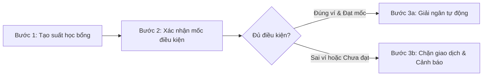

# Scholar - Giải ngân học bổng minh bạch

## 1. Giới thiệu dự án & Mục tiêu

**Scholar** là hệ thống phi tập trung hỗ trợ quản lý và giải ngân các quỹ học bổng sinh viên một cách minh bạch, tự động và an toàn trên nền tảng Blockchain.

- **Mục tiêu cốt lõi:**
  - **Chính xác & Minh bạch:** Đảm bảo tiền học bổng được tự động giải ngân đúng định mức, đúng thời điểm khi sinh viên đạt đủ các điều kiện/mốc học tập, nghiên cứu và rèn luyện.
  - **Kiểm soát rủi ro & Chống gian lận:** Thiết lập cơ chế kiểm tra điều kiện nghiêm ngặt on-chain nhằm ngăn chặn triệt để các giao dịch sai đối tượng, gửi nhầm địa chỉ ví hoặc rút vốn trái phép.

---

## 2. Danh sách thành viên nhóm

| STT | Họ và tên | Mã sinh viên | Vai trò / Nhiệm vụ phụ trách |
| :---: | :--- | :---: | :--- |
| 01 | [Họ tên - Mã SV 1] | [Mã SV 1] | Nhóm trưởng, Thiết kế kiến trúc & Quản lý dự án |
| 02 | [Họ tên - Mã SV 2] | [Mã SV 2] | Phát triển Smart Contract (Solidity) & Security Audit |
| 03 | [Họ tên - Mã SV 3] | [Mã SV 3] | Kiểm thử tự động (Unit Test / Integration Test) |
| 04 | [Họ tên - Mã SV 4] | [Mã SV 4] | Phát triển giao diện người dùng (DApp Web Frontend) |

---

## 3. Luồng nghiệp vụ cốt lõi

Quy trình giải ngân học bổng được thực thi tự động qua 3 bước khép kín trên Smart Contract:

1. **Bước 1: Tạo suất học bổng (Scholarship Allocation):**
   - Nhà trường, nhà tài trợ hoặc ban quản lý quỹ nạp quỹ và khởi tạo thông tin suất học bổng trên hợp đồng.
   - Thiết lập địa chỉ ví thụ hưởng của sinh viên, định mức giải ngân, thời hạn và các tiêu chí/mốc điều kiện cụ thể (ví dụ: GPA kỳ học, điểm rèn luyện, chứng chỉ).

2. **Bước 2: Xác nhận mốc điều kiện (Milestone Verification):**
   - Khi kết thúc kỳ đánh giá, kết quả học tập/rèn luyện của sinh viên được hội đồng thẩm định xác nhận.
   - Thẩm định viên/nhà trường kích hoạt giao dịch phê duyệt mốc thành tích hợp lệ trên hệ thống on-chain.

3. **Bước 3: Giải ngân hoặc Chặn giao dịch (Disbursement / Block):**
   - **Giải ngân (Disbursement):** Nếu sinh viên gọi yêu cầu nhận học bổng (claim) đúng từ địa chỉ ví đã đăng ký và mốc điều kiện đã được phê duyệt, hợp đồng thông minh lập tức chuyển chính xác số tiền vào ví sinh viên và phát sự kiện `ScholarshipDisbursed`.
   - **Chặn giao dịch (Block):** Nếu người yêu cầu giải ngân không nằm trong danh sách thụ hưởng, sai địa chỉ ví, chưa hoàn thành mốc điều kiện hoặc có dấu hiệu can thiệp bất thường, giao dịch lập tức bị hủy bỏ (`revert`) kèm mã lỗi tùy biến (`Custom Error`), ngăn chặn thất thoát ngân sách quỹ.

---

## 4. Công nghệ sử dụng

- **Solidity (`^0.8.20`):** Ngôn ngữ lập trình Smart Contract, xây dựng logic quỹ học bổng theo chuẩn OpenZeppelin 5.x, áp dụng mô hình *Checks-Effects-Interactions* và bảo mật phân quyền.
- **Layer 2 (Arbitrum / Optimism / Base):** Giải pháp mở rộng quy mô Ethereum giúp tối ưu hóa chi phí giao dịch (phí gas siêu rẻ, giảm hàng trăm lần so với Layer 1), đảm bảo tính khả thi kinh tế khi giải ngân số lượng lớn cho sinh viên.
- **Antigravity IDE:** Môi trường phát triển và kiểm thử tích hợp hiện đại, hỗ trợ pair-programming cùng AI, quản lý vòng đời Smart Contract và phân tích dữ liệu on-chain.

---

## 5. Hướng dẫn chạy thử

*(Phần này được để sẵn các bước khung để cập nhật chi tiết mã lệnh và quy trình chạy thử ở các bài Lab tiếp theo)*

- [ ] **Bước 1: Khởi tạo và cài đặt môi trường:**
  - 
- [ ] **Bước 2: Thiết lập biến môi trường (`.env`):**
  - 
- [ ] **Bước 3: Biên dịch Smart Contract:**
  - 
- [ ] **Bước 4: Chạy bộ kiểm thử tự động (Unit Tests):**
  - 
- [ ] **Bước 5: Triển khai thử nghiệm trên mạng Layer 2 Testnet:**
  - 
- [ ] **Bước 6: Khởi chạy giao diện DApp tương tác:**
  - 
